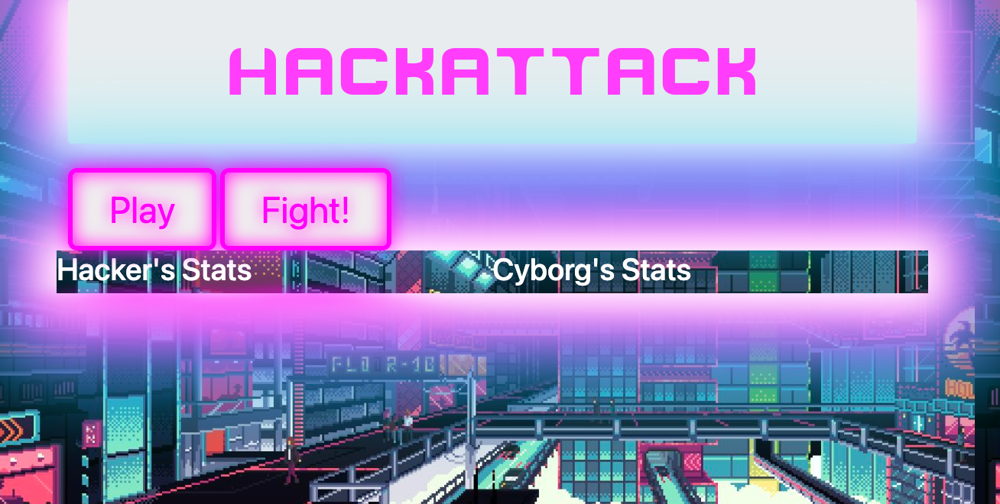

# Hack Attack RPG

#### By Joe Roaden & Joe Jack  

## Description

Simple rpg game built to practice using functional programming with state and props. Computer auto retaliates after user's turn.

## Technologies Used

* JavaScript
* EsLint
* Babel
* CSS
* Webpack

## Setup/Installation Requirements

1. Clone this repository to your local machine.
2. Install packages run `$ npm install`
3. Prepare repository to deploy run `$ npm build`
4. To view on local host run `$ npm run start` 

## Logic

Stretch Goals:
- Add a custom name to Hacker before play
- Make a splash page of sorts where you enter your name - hit begin
- Update styling

## Known Bugs

* Stats could be more balanced, more logic for when stats get to high or to low.

## License
- [MIT]

## Contact Information

Copyright (c) _8/2022_  -- _Joseph Jack_, _Joseph Roaden_ [GitHub Account](https://github.com/Josephwjack)